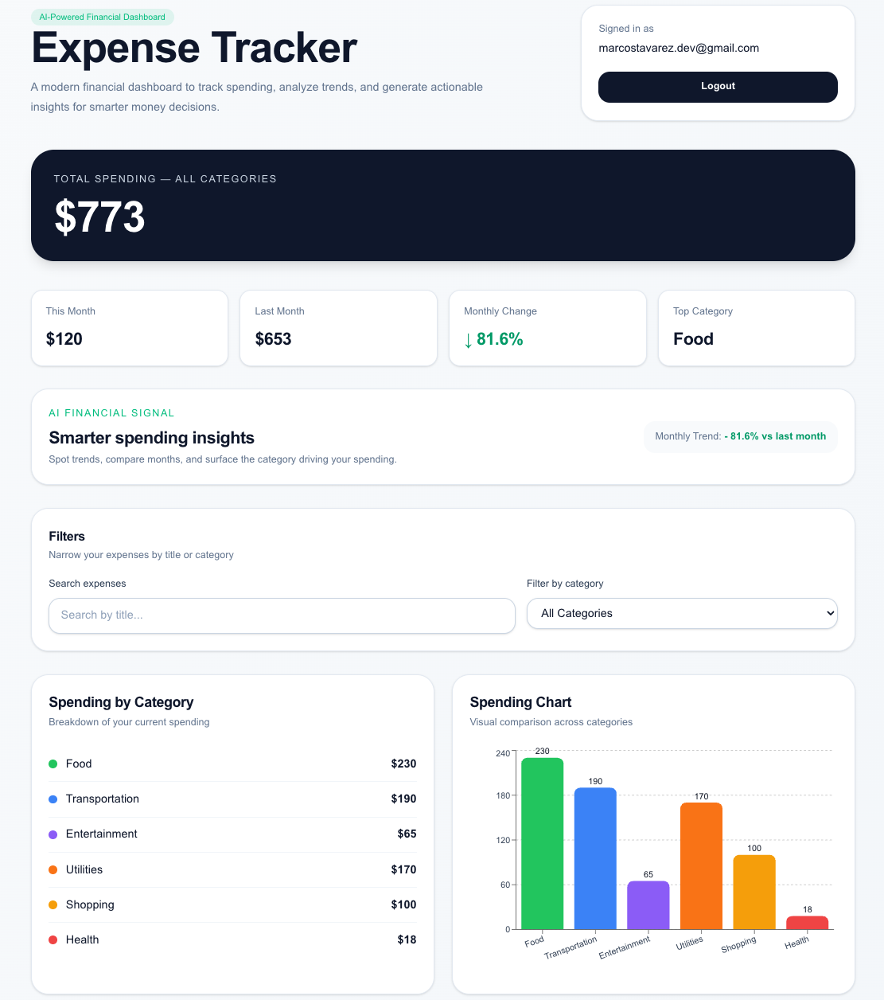

# 💸 Expense Tracker (Full Stack)

A production-ready expense tracking application with secure authentication, real-time analytics, and AI-powered financial insights.

---

## 🚀 Live Demo
👉 https://expense-tracker-wine-theta-32.vercel.app/

---

## 📸 Preview

### Dashboard

### Analytics & Insights

---

## 🧠 Problem

Managing personal finances is often fragmented across apps, spreadsheets, or manual tracking.  
Users lack **real-time visibility** and **actionable insights** into their spending habits.

---

## 💡 Solution

Built a full-stack expense tracking system that:

- Centralizes financial data
- Provides real-time analytics
- Uses AI to generate insights and recommendations
- Ensures secure and scalable user data management

---

## ⚙️ Tech Stack

- **Frontend:** Next.js (App Router), TypeScript, Tailwind CSS  
- **Backend:** Next.js API Routes  
- **Database:** PostgreSQL (Neon)  
- **ORM:** Prisma  
- **Authentication:** NextAuth (Credentials)  
- **AI Integration:** OpenAI API  
- **Deployment:** Vercel  

---

## 🧩 Core Features

- 🔐 Secure authentication system  
- 💸 Add, edit, and delete expenses  
- 🔍 Category filtering and search  
- 📊 Monthly analytics and visual charts  
- 🤖 AI-generated financial insights and spending patterns  

---

## 🏗️ Architecture

- RESTful API routes for data operations  
- Prisma ORM for type-safe database access  
- Modular component structure for scalability  
- Server-side data fetching with optimized performance  
- Environment-based configuration for secure deployment  

---

## 🧪 Production Considerations

- Input validation and error handling  
- Secure environment variables for API keys  
- Optimized queries using Prisma  
- Clean separation of concerns (UI / API / DB)  
- Scalable deployment using Vercel + Neon  

---

## 💡 Key Highlights

- Built full authentication system from scratch  
- Integrated AI to enhance user decision-making  
- Designed for scalability and maintainability  
- Production-ready deployment with real database  

---

## 👤 Author

**Marcos Tavarez**  
Full Stack Developer  
Available for remote & hybrid opportunities
